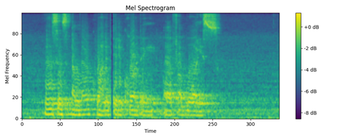
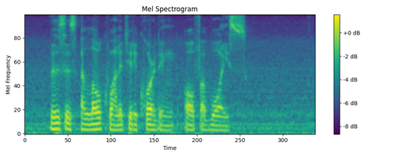

# VoiceRestore: Flow-Matching Transformers for Speech Recording Quality Restoration

VoiceRestore is a cutting-edge speech restoration model designed to significantly enhance the quality of degraded voice recordings. Leveraging flow-matching transformers, this model excels at addressing a wide range of audio imperfections commonly found in speech, including background noise, reverberation, distortion, and signal loss.

Demo of audio restorations: [VoiceRestore](https://sparkling-rabanadas-3082be.netlify.app/)

Credits: This repository is based on the [E2-TTS implementation by Lucidrains](https://github.com/lucidrains/e2-tts-pytorch)

## Example
### Degraded Input: 



Degraded audio (reverberation, distortion, noise, random cut):

**Note**: Adjust your volume before playing the degraded audio sample, as it may contain distortions.

https://github.com/user-attachments/assets/0c030274-60b5-41a4-abe6-59a3f1bc934b

---
### Restored (steps=32, cfg=1.0):


Restored audio - 16 steps, strength 0.5:

https://github.com/user-attachments/assets/fdbbb988-9bd2-4750-bddd-32bd5153d254

---
### Ground Truth:



---
## Key Features

- **Universal Restoration**: The model can handle any level and type of voice recording degradation. Pure magic.  
- **Easy to Use**: Simple interface for processing degraded audio files.
- **Pretrained Model**: Includes a 301 million parameter transformer model with pre-trained weights. (Model is still in the process of training, there will be further checkpoint updates)

---
## Quick Start

1. Clone the repository:
   ```bash
   git clone --recurse-submodules https://github.com/skirdey/voicerestore.git
   cd VoiceRestore
   ```

   if you did not clone with `--recurse-submodules`, you can run:
   ```bash
   git submodule update --init --recursive
   ```

2. Install dependencies:
   ```bash
   pip install -r requirements.txt
   ```

3. Download the [pre-trained model](https://drive.google.com/drive/folders/1uBJNp4mrPJQY9WEaiTI9u09IsRg1lAPR?usp=sharing) and place it in the `checkpoints` folder. (Updated 9/29/2024)

4. Run a test restoration:
   ```bash
   python inference_short.py --checkpoint ./checkpoints/voice-restore-20d-16h-optim.pt --input test_input.wav --output test_output.wav --steps 32 --cfg_strength 0.5
   ```
   This will process `test_input.wav` and save the result as `test_output.wav`.

5. Run a long form restoration, it uses window chunking:
   ```bash
   python inference_long.py --checkpoint ./checkpoints/voice-restore-20d-16h-optim.pt --input test_input_long.wav --output test_output_long.wav --steps 32 --cfg_strength 0.5 --window_size_sec 10.0 --overlap 0.25
   ```
   This will process `test_input_long.wav` (you need to provide it) and save the result as `test_output_long.wav`.

## Usage

To restore your own audio files:

```python
from model import OptimizedAudioRestorationModel

model = OptimizedAudioRestorationModel()
restored_audio = model.forward(input_audio, steps=32, cfg_strength=0.5)
```


## Model Details

- **Architecture**: Flow-matching transformer
- **Parameters**: 300M+ parameters
- **Input**: Degraded speech audio (various formats supported)
- **Output**: Restored speech

## Limitations and Future Work

- Current model is optimized for speech; may not perform optimally on music or other audio types.
- Ongoing research to improve performance on extreme degradations.
- Future updates may include real-time processing capabilities.

## Citation

If you use VoiceRestore in your research, please cite our paper:

```
@article{kirdey2024voicerestore,
  title={VoiceRestore: Flow-Matching Transformers for Speech Recording Quality Restoration},
  author={Kirdey, Stanislav},
  journal={arXiv},
  year={2024}
}
```

## License

This project is licensed under the MIT License - see the [LICENSE](LICENSE) file for details.

## Acknowledgments

- Based on the [E2-TTS implementation by Lucidrains](https://github.com/lucidrains/e2-tts-pytorch)
- Special thanks to the open-source community for their invaluable contributions.
